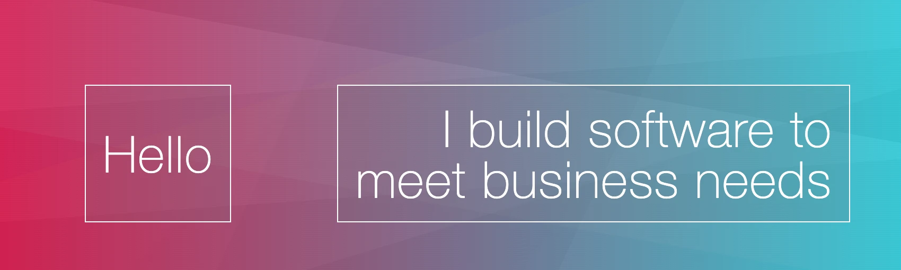

<!--
**mvellandi/mvellandi** is a ✨ _special_ ✨ repository because its `README.md` (this file) appears on your GitHub profile.

Here are some ideas to get you started:

- 🔭 I’m currently working on ...
- 🌱 I’m currently learning ...
- 👯 I’m looking to collaborate on ...
- 🤔 I’m looking for help with ...
- 💬 Ask me about ...
- 📫 How to reach me: ...
- 😄 Pronouns: ...
- ⚡ Fun fact: ...
-->

# 
Hi! I&apos;m a software engineer with a strong orientation toward product development and UX design. In the last few years, I've built up a portfolio, helped a professional client, and recently finished Dockyard Academy, a 3-month training for software development.

I&apos;m eager to jump in, solve problems, and to whatever it takes to make customers happy, reduce expenses, and increase revenue.

Aside from the tech skills below I&apos;m confident with, I have used other languages and tech and can quickly pick up new ones. Currently, I am learning Golang.

- **Languages**: Elixir, JavaScript, HTML, CSS
- **Frontend**: LiveView, React, Tailwind
- **Frameworks**: Phoenix, Next.js
- **Design**: Figma
- **CMS**: Sanity

Lastly, I carry forward project management and writing skills from my previous career in content strategy.

To see my portfolio, writing, and learn more about me:

- [My Website](http://www.vellandi.net)
- [LinkedIn](https://www.linkedin.com/in/mvellandi/)
- [Twitter](https://twitter.com/servusmario)

### How can I help you?