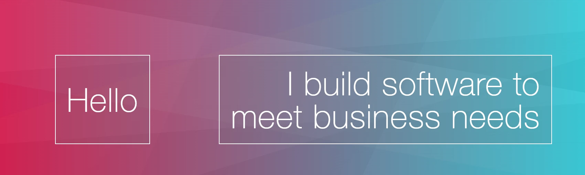

<!--
**mvellandi/mvellandi** is a ✨ _special_ ✨ repository because its `README.md` (this file) appears on your GitHub profile.

Here are some ideas to get you started:

- 🔭 I’m currently working on ...
- 🌱 I’m currently learning ...
- 👯 I’m looking to collaborate on ...
- 🤔 I’m looking for help with ...
- 💬 Ask me about ...
- 📫 How to reach me: ...
- 😄 Pronouns: ...
- ⚡ Fun fact: ...
-->

<picture></picture>

# 
Hi! I&apos;m a software engineer with a strong orientation toward product development and communications.
I first began building websites in my early career, followed by frontend development, email design, and content strategy.
Later, I began learning software engineering on my own and through training programs including [Dockyard Academy](https://academy.dockyard.com/) and [Boot.dev](https://boot.dev/).

All my new projects are self-hosted using Coolify and Docker.
Currently I'm exploring agentic engineering using Codex, Claude Code, Pi, various models, and my own meta harness [Saddle](https://github.com/mvellandi/saddle).
Aside from the tech skills below I&apos;m confident with, I have used other languages and tech and can quickly pick up new ones.

- **Languages**: TypeScript, Elixir, HTML, CSS
- **Backend Libraries**: Effect, oRPC, Drizzle, Zod
- **AI Libraries**: Mastra
- **Frontend**: React, Tailwind, LiveView
- **Frameworks**: TanStack Start, Next.js, Phoenix
- **Authentication**: Zitadel, Better Auth
- **Design**: Pencil, Paper, Figma, Illustrator, Photoshop
- **Video**: Hyperframes, Remotion, DaVinci Resolve, Kapwing
- **CMS**: Sanity, Wordpress

Lastly, I carry forward project management and writing skills from my previous career in content strategy.

Please [contact me](https://www.vellandi.net/contact) if you'd like to chat about your project or just want to say hello.
To see my portfolio, writing, and learn more about me:

- [My Website](http://www.vellandi.net)
- [LinkedIn](https://www.linkedin.com/in/mvellandi/)
- [Twitter](https://twitter.com/triforcekid7)

## How can I help you?
